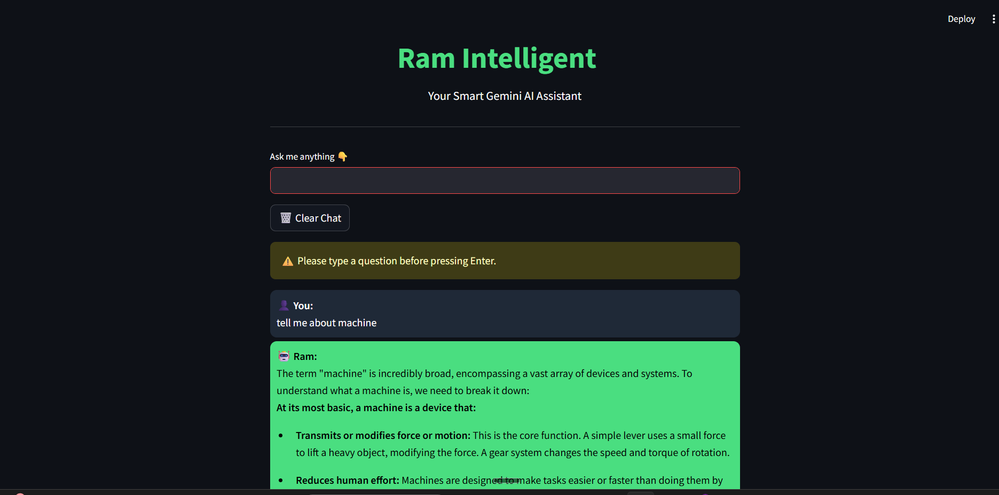

# 🤖 Gemini Chatbot

A simple chatbot powered by Google Gemini 1.5 Flash API and Streamlit.

---

## 🛠️ How to Run

1. **Install dependencies**  

2. **Set your Gemini API key**  
Open `modules/gemini_utils.py` and replace `"YOUR_API_KEY"` with your own.

3. **Start the app**  

---

## 📸 Screenshot

Place your app screenshot in `assets/screenshot.png` and it will show here:

